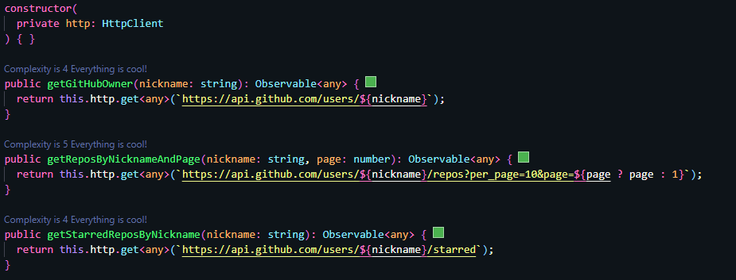

# Introdução
#### Este projeto visa listar repositórios cadastrados no [GitHub](https://github.com/) através do fornecimento de um `nickname`, o qual se refere a identificação do usuário que cadastrou tais repositórios. O projeto fornece duas áreas para listagem, uma para todos os repositórios e outra para apenas os que foram marcados com `estrela`.
> Para acessar o projeto hospedado em um provedor [clique aqui](https://git-hub-repos.vercel.app/)

&nbsp;
## Home
#### Esta tela possui um campo para inserir o `nickname` do usuário, o botão `pesquisar` e uma breve descrição sobre a aplicação. Após preencher o campo e clicar no botão, a aplicação irá listar os repositórios referentes àquele usuário.
&nbsp;
## Listas
#### Após a aplicação gerar a listagem dos repositórios, o usuário poderá notar que além das listas de `Todos` e `Favoritos`, ela também exibe o avatar e `nickname` do usuário pesquisado. O usuário poderá clicar sobre o `nickname` e a aplicação abrirá uma nova aba no navegador com o perfil do usuário pesquisado no site do [GitHub](https://github.com/).
> - Ambas as listas fornecem: Nome do repositório e descrição
> - Ao clicar sobre o nome do repositório, a aplicação abrirá uma página do [GitHub](https://github.com/) apresentando-o.

&nbsp;
---
# Estrutura do projeto
## **1** Componentes
|Ilustração|Detalhes|
|----------|--------|
||Aqui estão os componentes do `Header(1.1)`, `Home(1.2)` e as `listas(1.3)`. No caso das `Listas`, o projeto utiliza um componente reutilizável `repos-table` para ambas as `listas`. O diretório de `serviços(2)` é onde estão os mecanismos de requests feitos à API do GitHub|

&nbsp;

## **1.1** Header

Este componente é responsável por detectar o valor do `nickname` inserido no `input` no HTML e o envia para a rota `/list` como `query parameter` como mostra o snipet abaixo. Caso o `nickname` esteja vazio, a aplicação retorna à Home. Daquele modo, as listas realizam o request à API do GitHub para buscar os dados. 
```
public search(): void {
  this.nickname ?
  this.router.navigate(['/list'], { queryParams: { nickname: this.nickname }}) :
  this.router.navigate(['/home']);
}
```
&nbsp;

## **1.2** Home

A Home é uma breve descrição sobre a aplicação. Explica suas funcionalidades e como utilizá-la.

&nbsp;

## **1.3** Listas

Assim que o usuário pesquisa pelo `nickname`, este componente é carregado e de início, ele realiza a pesquisa do usuário para implementar o avatar e o link para seu perfil:
```
private getGitHubOwner(nickname: string): void {
  this.gitHubService.getGitHubOwner(nickname).subscribe(
    response => this.setOwnerObject(response),
    error => this.toastrService.error('Usuário não pôde ser encontrado.', 'Erro', error)
  );
}
```

Para as listas, há um subcomponente para fins de reutilização de código e componentização. Cada lista recebe o `nickname` e um parâmetro booleano para diferenciar se é a lista `Todos` ou `Favoritos`, como mostra o snipet abaixo.
```
<div class="mx-3">
  <app-repos-table [setNickname]="nickname" [totalPages]="totalPages" *ngIf="selectedTab === 1"></app-repos-table>
  <app-repos-table [setNickname]="nickname" [starred]="true" *ngIf="selectedTab === 2"></app-repos-table>
</div>
```
### **1.3.1** Tabelas
Assim que o componente recebe os `nickname` e tipo de lista, ele seleciona qual request fará: 
```
@Input()
set setNickname(nickname: string) {
  this.nickname = nickname;
  this.selectList(nickname);
} 
```
```
private selectList(nickname: string): void {
  this.starred ?
  this.getRepoStarredListByNinkname(nickname) :
  this.getRepoListByNinkname(nickname);
}
```
Caso seja a lista `Todos`, ele realiza o request a seguir:
```
private getRepoListByNinkname(nickname: string): void {
  this.gitHubService.getReposByNicknameAndPage(nickname, this.selectedPage).subscribe(
    response => this.repoList = this.setRepoObject(response),
    error => this.toastrService.error('A lista de repositórios não pôde ser carregada.', 'Erro', error)
  );
}
```
Caso seja lista de `Favoritos`:
```
private getRepoStarredListByNinkname(nickname: string): void {
  this.gitHubService.getStarredReposByNickname(nickname).subscribe(
    response => this.repoList = this.setRepoObject(response),
    error => this.toastrService.error('A lista de repositórios favoritos não pôde ser carregada.', 'Erro', error)
  );
}
```
Para fins de reutilização de código, ambos os requests utilizam o método `setRepoObject` o qual trata os dados recebidos para a listagem no HTML.

&nbsp;

# **2** Serviços
Serviços são os responsáveis por realizar requisições à API do GitHub e retornar com os dados para a aplicação.



Como mostra o código acima, a aplicação utiliza a biblioteca HttpClient para realizar os requests e retorna os resultados como um Observable. 

&nbsp;

# Tratamento de exceções
A aplicação utiliza a biblioteca `ngx-toastr` em todos os requests codificados, para exibir um aviso quando um request foi mal-sucedido, como mostram os exemplos a seguir:


